# Dominio 1: Fundamentos de IA y ML

---

## 1. Conceptos básicos y terminología

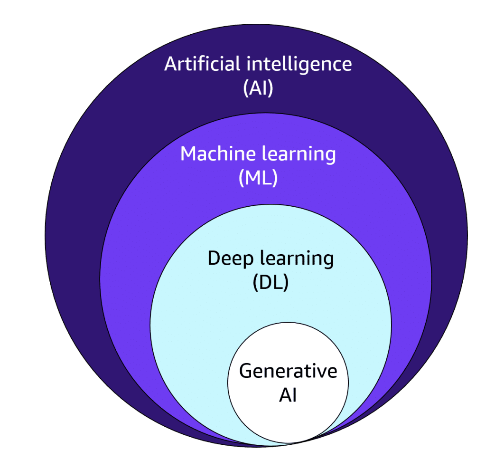

### Definiciones compactas

- **IA (Inteligencia Artificial)**: cualquier sistema que realiza tareas que normalmente requieren inteligencia humana.
- **Machine Learning (ML)**: métodos que aprenden reglas desde datos.
- **Deep Learning (DL)**: subcampo de ML con redes neuronales profundas.
- **Generative AI (GenAI)**: modelos (habitualmente DL) que generan contenido nuevo. Suelen usar embeddings.

### Paradigmas

- **Programación tradicional**: entrada + reglas → salida. Reglas fijas.
- **Programación ML**: entrada + salida → reglas. Reglas dinámicas y adaptables.

### Terminología esencial

- **Etiqueta / Target**: variable dependiente. Lo que intentas predecir.
- **Característica / Feature**: variable independiente. Datos que ayudan a predecir.
- **Ingeniería de características**: transformaciones de datos para aumentar su valor predictivo.
- **Selección de funciones (feature selection)**: elegir las variables más valiosas o subconjuntos.

### Tipos de Machine Learning

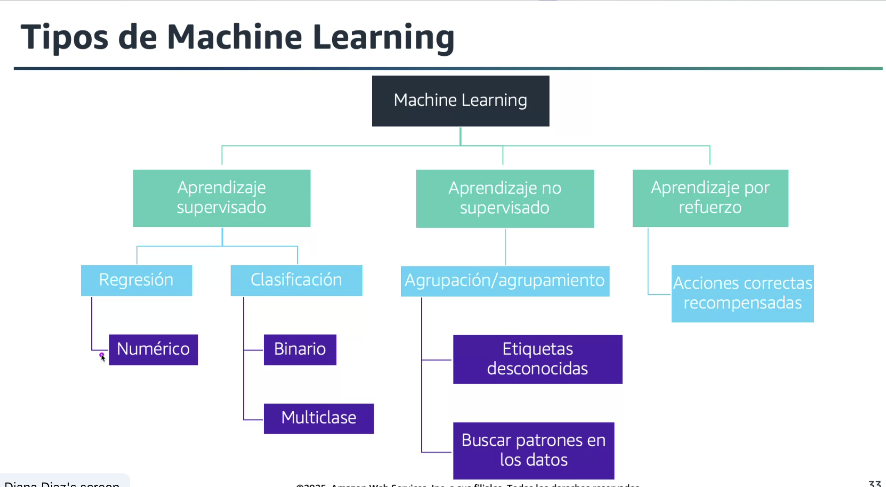

#### Aprendizaje Supervisado

Se entrena con ejemplos (entrada + etiqueta). El modelo aprende a predecir la etiqueta a partir de la entrada.

**Ejemplo**: Foto de perro → etiqueta Perro. Si el modelo predice Gato se corrige con la etiqueta real.

**Cuándo usar**: cuando tienes etiquetas confiables y claras.

#### Aprendizaje No Supervisado

No usa etiquetas. El algoritmo descubre patrones en los datos.

**Cuándo usar**: exploración de datos, segmentación, detección de anomalías.

#### Aprendizaje por Refuerzo (Reinforcement Learning)

Un agente toma acciones en un entorno. Recibe recompensas y aprende una política que maximice recompensas.

**Cuándo usar**: videojuegos, robótica, optimización secuencial.

#### Aprendizaje Auto-supervisado (Self-Supervised)

Se extraen etiquetas sintéticas del propio dato. El modelo se entrena con tareas creadas automáticamente.

**Ejemplos de tareas**:

- Masked token prediction: borrar una palabra/token y predecirla.
- Next-token / autoregresivo: predecir el siguiente token en secuencia.

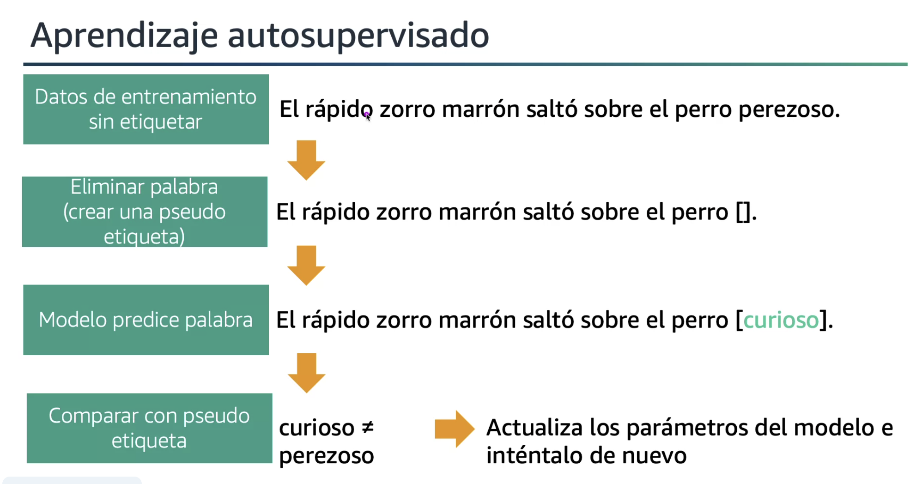

### GenAI / LLMs: qué se usa

- **Pre entrenamiento principal**: auto-supervisado.
- **Ajuste fino (fine-tuning)**: a veces supervisado en tareas específicas con etiquetas humanas.
- **RLHF (Reinforcement Learning from Human Feedback)**: usar preferencias humanas para construir un modelo de recompensa y optimizar respuestas (refuerzo sobre políticas).

---

## 2. Casos prácticos de uso para IA

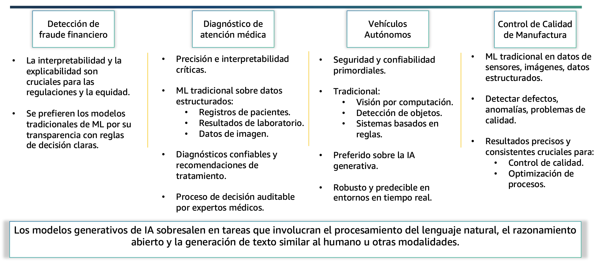
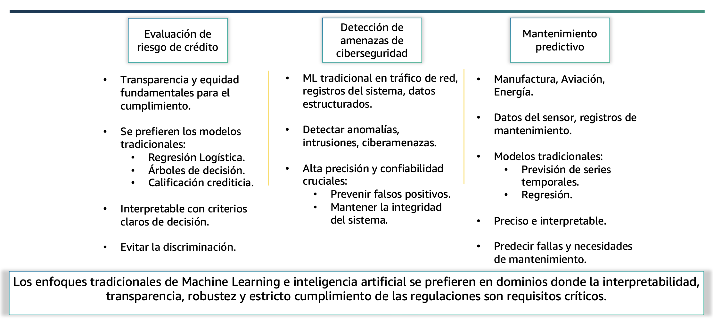

### Cuándo usar ML vs GenAI

**Usa ML tradicional cuando necesitas**:

- Transparencia e interpretabilidad.
- Robusteza y consistencia.
- Buen rendimiento con datasets pequeños o medianos.
- Auditoría y control de sesgos en sectores regulados.

**Usa GenAI cuando necesitas**:

- Generar texto, imágenes, código u otros contenidos nuevos.
- Respuestas conversacionales o creatividad controlada.
- Recuperación y ampliación de conocimiento vía embeddings + RAG.

**Regla práctica**: si el problema exige trazabilidad, preferir modelos tradicionales; si exige creatividad o generación, usar GenAI (evaluar riesgo de "hallucinations").

### Servicios de AWS

- **Visión**: clasificación, detección, análisis de imágenes → `Amazon Rekognition`
- **Extracción de texto de documentos**: OCR y campos estructurados → `Amazon Textract`
- **NLP y análisis de texto**: extracción de entidades, sentimiento, clasificación → `Amazon Comprehend`
- **Búsqueda semántica / recuperación**: buscadores con embeddings → `Amazon Kendra`
- **Personalización y recomendaciones**: sistemas de recomendación → `Amazon Personalize`
- **Detección de fraude**: reglas + modelos ML especializados → `Amazon Fraud Detector`
- **Plataforma de ciclo ML**: entrenamiento, despliegue, monitorización → `Amazon SageMaker`

---

## 3. Proceso / ciclo de vida de ML

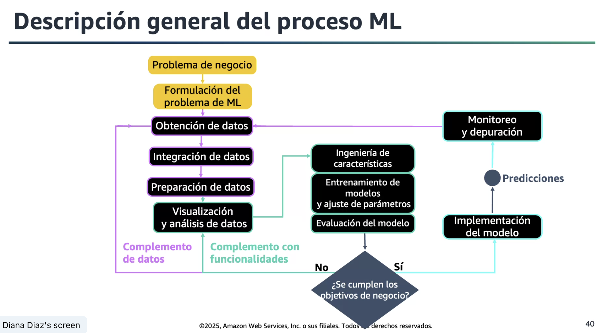

1. **Definir problema**: métrica objetivo, restricciones, impacto.
2. **Recolección de datos**: fuentes, permisos, calidad.
3. **Exploración y limpieza**: outliers, nulos, balance de clases.
4. **Ingeniería de features**: transformar, crear, normalizar.
5. **Selección / entrenamiento de modelo**: baseline → iteración.
6. **Evaluación**: train/val/test, métricas (accuracy, F1, AUC, RMSE según caso).
7. **Despliegue**: contenedor, endpoint, versiones.
8. **Monitorización**: deriva de datos, rendimiento, latencia, drift y alertas.
9. **Mantenimiento**: re-entrenamiento, pipelines automatizados.

### Amazon AI/ML Stack

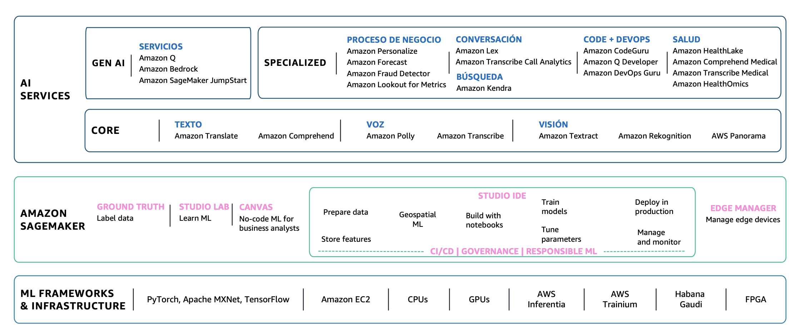

### Amazon SageMaker

Plataforma completa para el ciclo de vida de ML: entrenamiento, despliegue y monitorización de modelos.

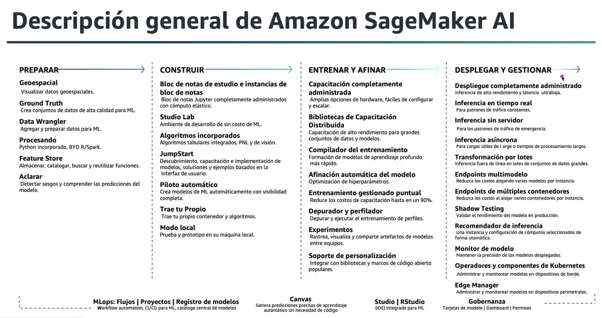

### Amazon Rekognition

Automatiza el análisis de imágenes y videos con aprendizaje automático.

**Casos de uso**:

- Análisis de medios.
- Verificación de identidad.
- Moderación de contenido.

**Características clave**:

| Etiquetas                      | Etiquetas personalizadas           |
| ------------------------------ | ---------------------------------- |
| Moderación de contenido        | Detección de texto                 |
| Detección facial               | Búsqueda y verificación de rostros |
| Reconocimiento de celebridades | Pathing                            |

### Amazon Textract

Extrae texto y datos de cualquier documento usando ML sin trabajo manual.

**Casos de uso**:

- Crear índices de búsqueda inteligentes.
- Automatizar flujos de procesamiento de documentos.
- Mantener cumplimiento en archivos documentales.

**Beneficios**:

- Extrae datos estructurados y no estructurados.
- Va más allá del OCR simple.
- Soporta seguridad y cumplimiento.
- Permite implementar revisiones humanas.

### Amazon Comprehend

Descubre ideas y relaciones dentro del texto.

**Casos de uso**:

- Análisis del centro de atención al cliente.
- Indexado y búsqueda de reseñas de productos.
- Personalización de contenido en sitios web.

**Beneficios**:

- Obtener respuestas a partir de texto.
- Organizar documentos por temas.
- Entrenar modelos con tus propios datos.
- Soporte para texto general y específico de industria.

### Amazon Kendra

Servicio de búsqueda empresarial basado en ML.

**Clientes destacados**: CORD-19 (conjunto de datos de investigación COVID-19)

**Casos de uso**:

- Mejorar acceso al conocimiento interno.
- Soporte de ventas y atención al cliente.
- Ayudar a usuarios a encontrar información eficientemente.

**Beneficios**:

- Consultas en lenguaje natural y respuestas inmediatas.
- Reúne datos con pocos clics.
- Mejora continuamente los resultados de búsqueda.

### Amazon Personalize

Crea experiencias personalizadas en tiempo real y a escala.

**Casos de uso**:

- **Retail**: ayudar a clientes a descubrir productos.
- **Medios**: recomendar contenido según preferencias.

**Beneficios**:

- Entregar recomendaciones en tiempo real.
- Implementar recomendaciones en días.
- Personalizar puntos de contacto a lo largo del recorrido del cliente.

### Amazon Fraud Detector

Detecta fraudes en línea de forma rápida.

**Casos de uso**:

- Nueva cuenta fraudulenta.
- Pago en línea fraudulento.
- Checkout como invitado.
- Abuso de servicio y programas de lealtad.

**Beneficios**:

- Previene y detecta fraudes en línea.
- Detección de fraude en minutos.
- Personalizable según las necesidades del negocio.

---

## Quiz

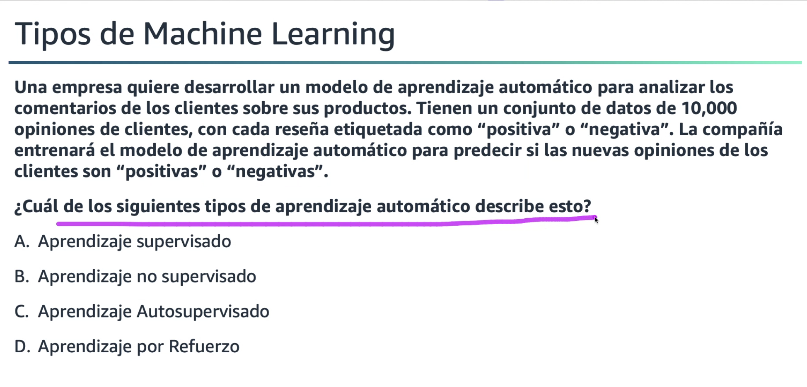

**Respuesta**: A - Supervisado.

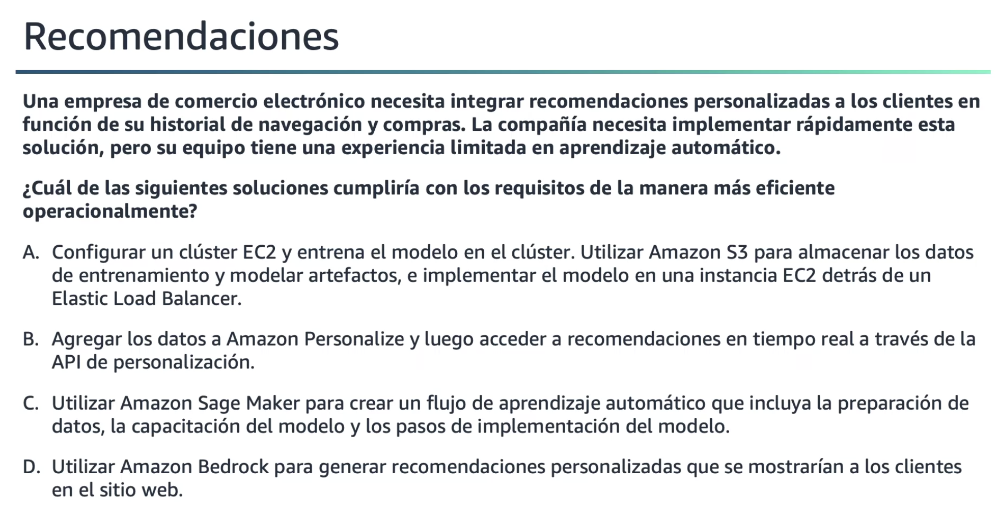

**Respuesta**: B - Utilizar Amazon Personalize.

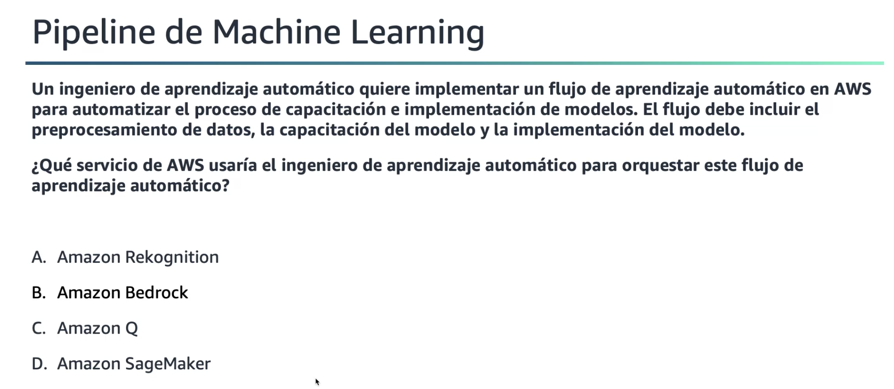

**Respuesta**: D - SageMaker.

---
