# Dominio 2: Fundamentos de la IA Generativa

---

## 1. Conceptos básicos de la IA generativa

### Modelo Fundacional (Foundation Model - FM)

Son sistemas de IA entrenados con cantidades masivas de datos, que aprenden patrones generales y sirven como base para múltiples aplicaciones.

### Ciclo de vida FMs

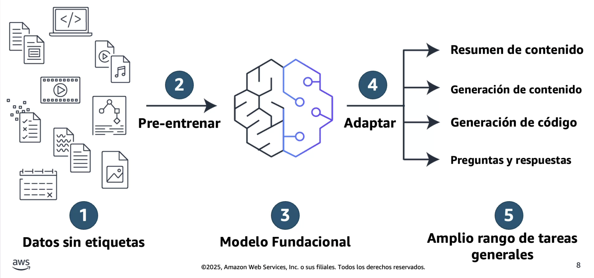

> El pre entrenamiento es de tipo “Auto-Supervisado”.

### Tipos de FMs

#### Modelos texto a texto

Son modelos de lenguaje grande (LLM) que están pre entrenados para procesar grandes cantidades de datos textuales y lenguaje humano.

#### Modelos de texto a imagen

Toman entrada de lenguaje natural y producen imagen de alta calidad que coincide con la descripción del texto de entrada.
Arquitectura de difusión.

#### Multimodales

Pueden recibir distintos tipos de entrada (imagen, texto, audio) y producen distintos tipos de salida.

- **Procesamiento del lenguaje natural (PNL).**
- **Large Language Model (LLM):** Son un tipo de Foundation Model.

### Componentes de FMs

#### Datos sin etiquetar

- Más fácil de obtener en comparación con datos etiquetados.
- Los modelos de pre entrenamiento toman en cuenta el contexto a partir de todos de los datos de entrenamiento.
  - Realiza un seguimiento de las relaciones en datos secuenciales.

#### Modelo Grande

- Miles de millones de parámetros.
- Los modelos de pre entrenamiento de este tamaño requieren acceso a:
  - Cantidad y calidad suficientes de los datos de entrenamiento.
  - Infraestructura de entrenamiento a gran escala.

### ¿Cómo se procesan estos datos sin etiquetar?

#### Transformer

> Salió en 2017, paper “Attention is all you need”; propuso una arquitectura que dio base a toda la IA generativa actual.

- Es un tipo especifico de Red Neuronal que potencia los modelos fundacionales mediante el procesamiento de secuencias de información.
- Analiza las relaciones entre palabras o imágenes para comprender el contexto y el significado.
- Transforma las entradas en salidas relevantes utilizando su comprensión de las relaciones entre palabras.

#### Beneficios del Transformer

- Procesamiento paralelo.
- Mecanismo de atención (es capaz de mantener la atención en algo especifico, a pesar del “ruido”).
- Flexibilidad y escalabilidad.

#### Ejemplo

Cachorro es a perro como pollito es a…
->

**¿Cómo un Modelo Transformer completa la oración?:**

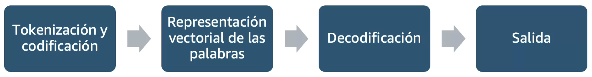
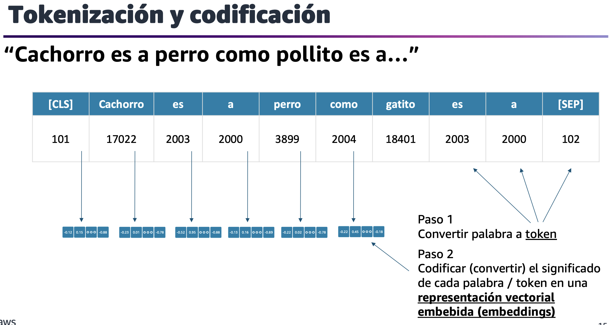
> Embedding: Representación vectorial/numérica.

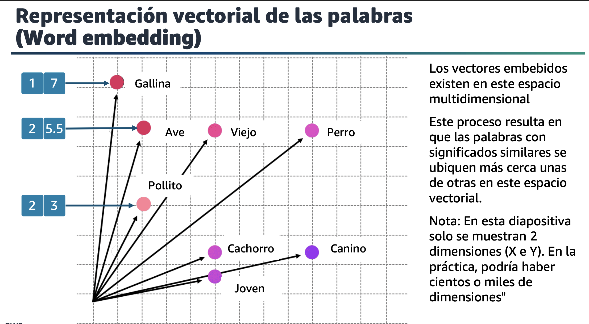
> Ejemplo simplificado, los Embeddings pueden tener cientos de dimensiones.

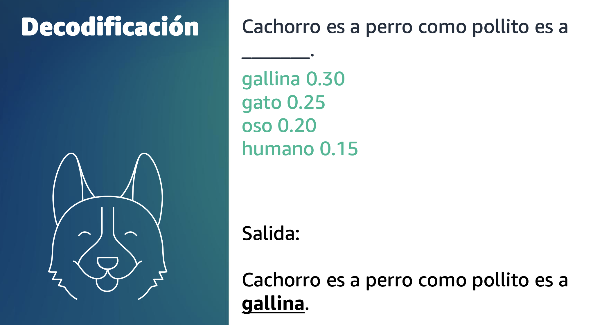

---

## 2. Capacidades y limitaciones de la IA generativa para resolver problemas comerciales

### Parámetros de inferencia - Aleatoriedad y diversidad

#### Inferencia

Proceso de ejecutar un modelo ya entrenado para producir predicciones; optimizada por latencia, throughput y costo.

#### Filtrado y limitación de Tokens

- Top k
- Top p

#### Control de creatividad

- Temperatura

#### Ejemplos

#### Top k

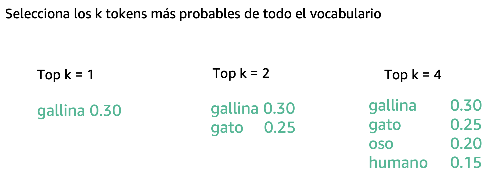

#### Top p

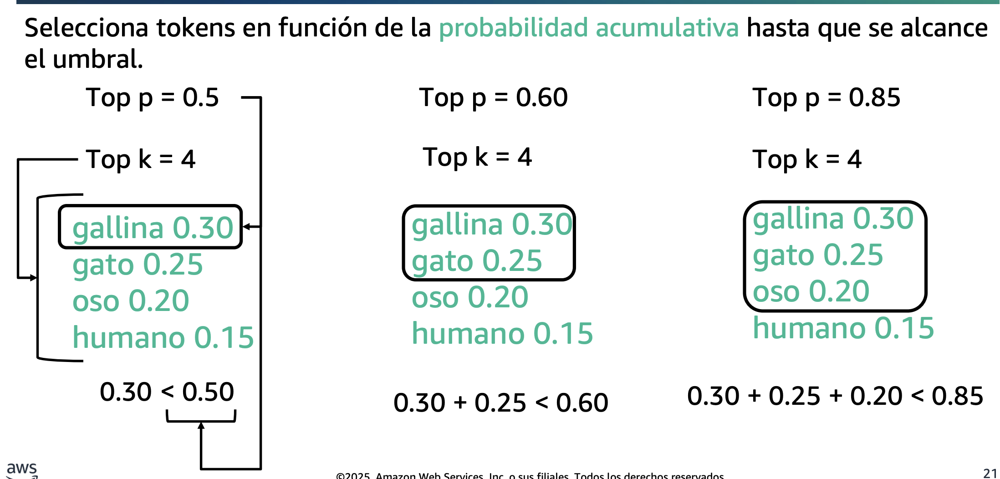

#### Temperatura

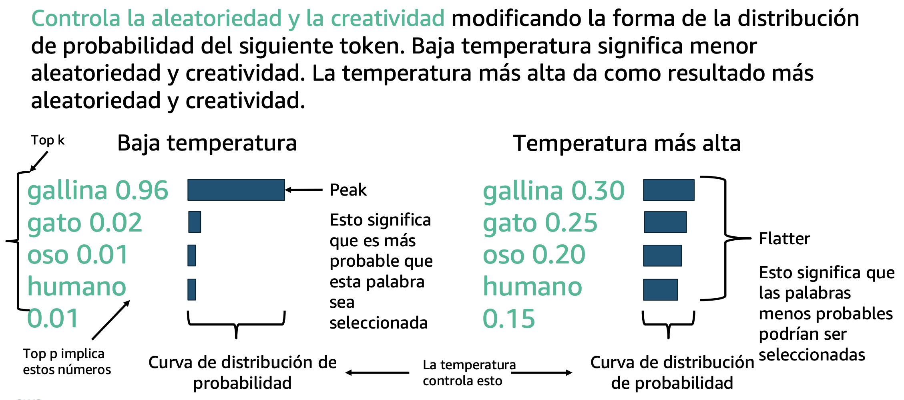

### Parámetros de inferencia - Longitud

#### Longitud de respuesta

- Un valor exacto para especificar el número mínimo o máximo de tokens que se devolverán en la respuesta generada.
- Ayuda a gestionar los recursos computacionales y costos.

#### Penalizaciones

- Especificar el grado que se penalizarán las salidas en una respuesta.
- Ejemplos:
  - La longitud de la respuesta.
  - Tokens repetidos en una respuesta.
  - Frecuencia de tokens en una respuesta.
  - Tipos de tokens en una respuesta.

#### Secuencias de detención

- Especificar secuencias de caracteres que detienen al modelo para que no genere más tokens.
- Si el modelo genera una secuencia de parada que usted especifica, dejará de generar después de esa secuencia.

### Contexto

El contexto es un intercambio privado entre el usuario y el modelo.

- No persiste.
- Hay un límite superior en el número de tokens.
- Se puede perder la información inicial que está utilizando el modelo.

> **IMPORTANTE**: El modelo no lee tu último mensaje, lee TODA LA CONVERSACIÓN de nuevo después de cada mensaje. Por eso mientras más largo haces el chat, más baja la calidad de respuesta.

#### Ejemplo

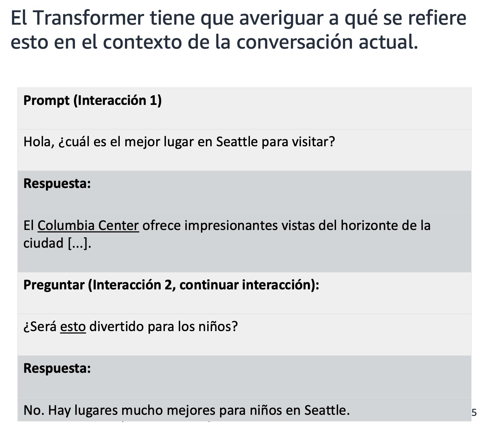

### Preocupaciones de IA Generativa

- Toxicidad
- Alucinaciones
- Propiedad Intelectual
- Plagio y trampa
- Disrupción de la naturaleza del trabajo

---

## 3. Infraestructura y tecnologías de AWS para crear aplicaciones generativas de IA

### Recursos de IA generativa de AWS

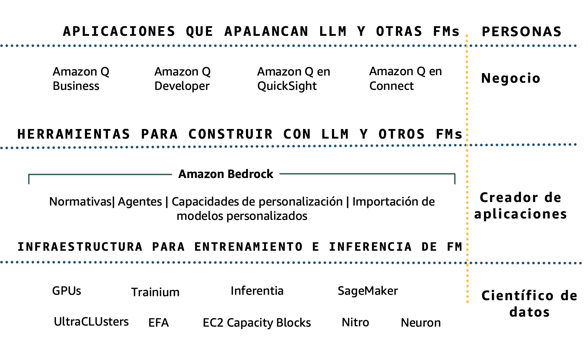

### Innovando a nivel de Silicio

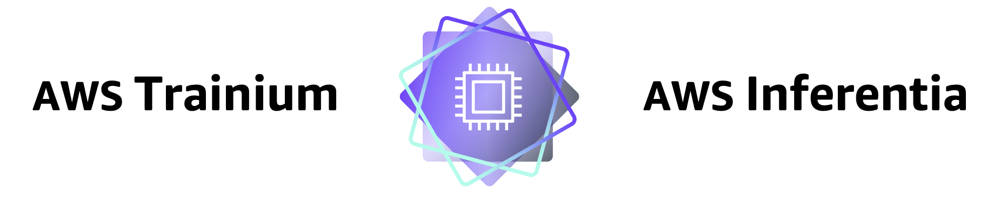

#### AWS Trainium

Familia de chips de AWS optimizados para entrenamiento e inferencia de modelos DL.

#### AWS Inferentia

Acelerador diseñado para inferencia a gran escala, con soporte en instancias Inf.

- Son más 70% más eficientes frente a instancias EC2 similares.

### Servicios AWS

#### Amazon SageMaker AI

Crea, entrena e implementa modelos de ML a escala, incluidos los FMs.

- Accede a los últimos FMs disponibles públicamente a través de SageMaker Jumpstart.
- Construye FMs desde cero.
- Personaliza FMs.
- Ejecuta inferencia.
- Implementa FMOPs y gobernanza.

#### Amazon Bedrock

- Elección de FMs líderes a través de una única API.
- Personalización del modelo.
- Generación Aumentada de Recuperación (RAG).
- Agentes que ejecutan tareas de varios pasos.
- Seguridad, privacidad y gobierno.

#### Amazon Q

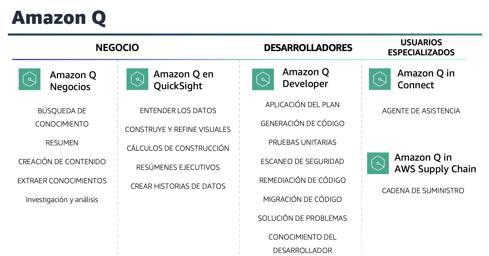

- **Amazon Quick Suite** fue anunciado el 9-oct-2025 como evolución/unificación de QuickSight con capacidades Agentic AI y nuevas herramientas (Quick Sight mantiene visualización dentro del suite y clientes QuickSight serán migrados).

> Es probable que en el examen entre QuickSight, ya que se suelen demorar hasta 6 meses en agregar nuevos servicios al examen .

#### PartyRock

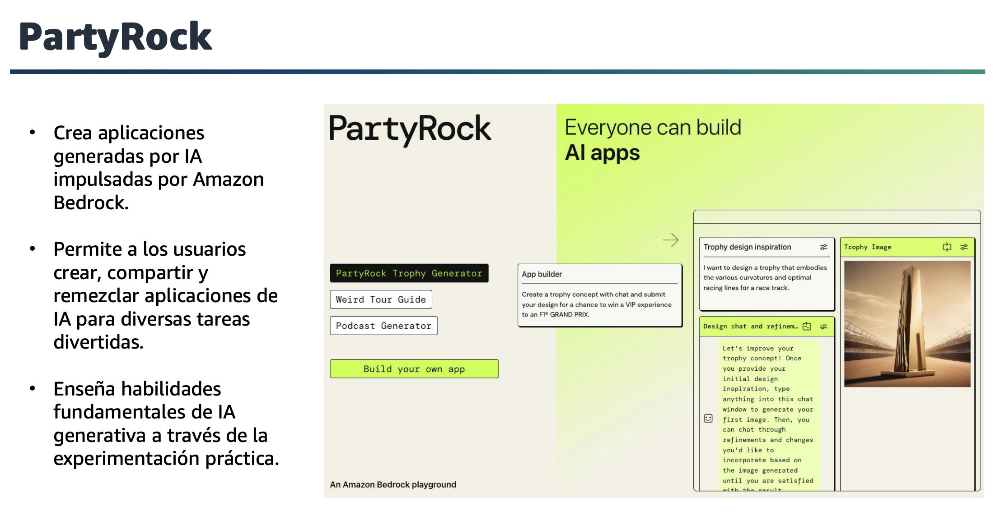

### Enfoques comunes para personalizar FMs

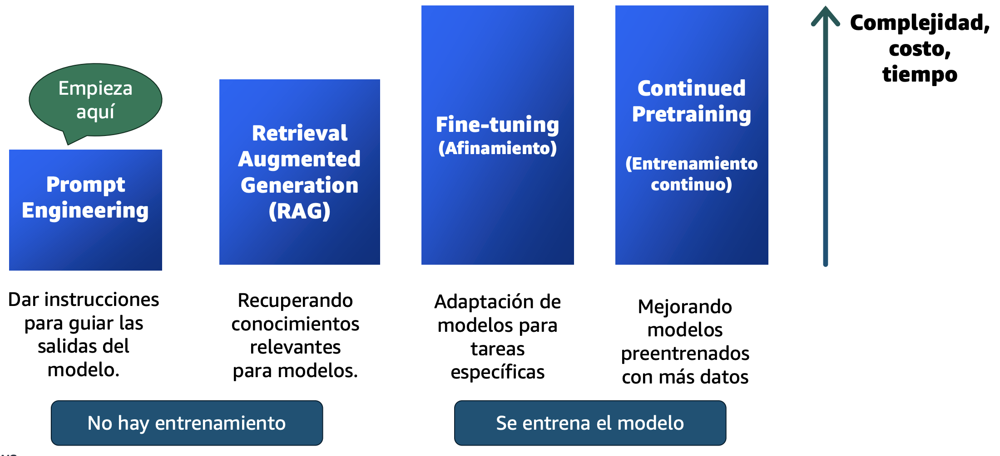

### Personalización de las respuestas del modelo para su negocio

#### Afinamiento

- Maximizar la precision para tareas especificas.
- Pequeño número de ejemplos etiquetados.

#### Pre entrenamiento continuo

- Mantener la precision del modelo para su dominio.
- Gran cantidad de conjuntos de datos sin etiquetar.

---

## Quiz

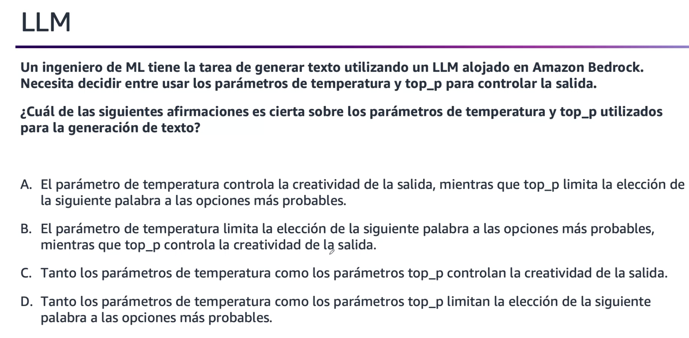
**Respuesta:** A - Temperatura = creatividad, top_p =  limita elección de siguientes tokens de acuerdo a la probabilidad.

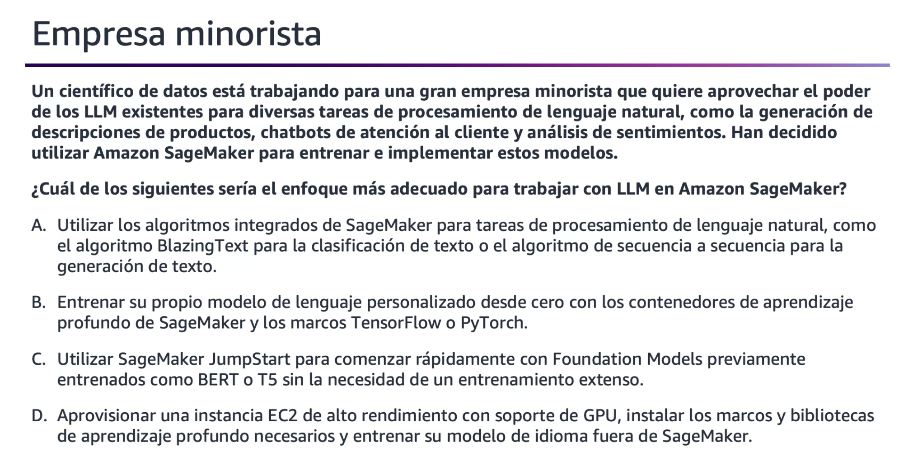
**Respuesta:** C - SageMaker JumpStart permite comenzar rápidamente con Foundation Models previamente entrenados, como BERT o T5.

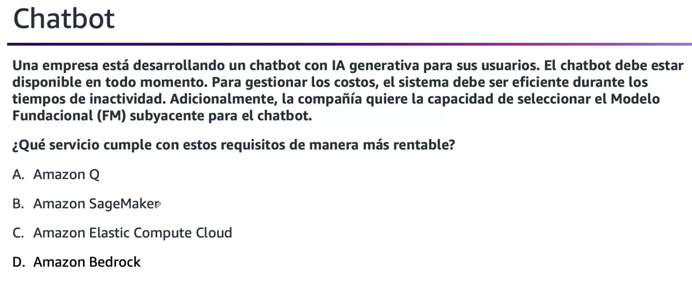
**Respuesta:** D - Amazon Bedrock, ya ofrece FM entrenados y cobra solo por uso de Tokens.

---

## Infografia útil

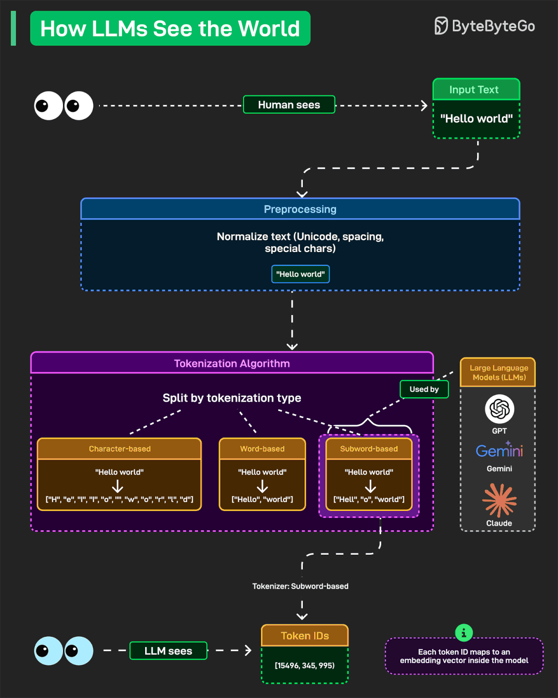
