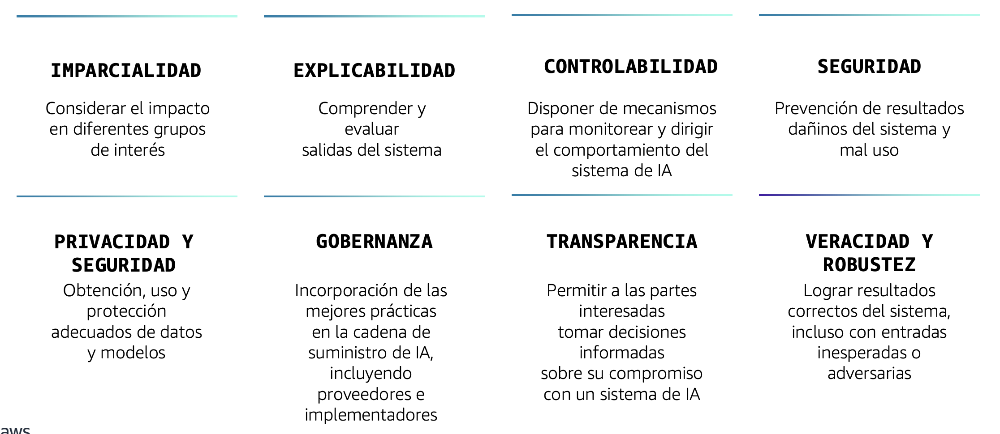

# Dominio 4: Directrices para IA Responsable

---

## 1. Desarrollo de Sistemas de IA Responsable

### ¿Qué es la IA Responsable?

La IA responsable se refiere al desarrollo y uso de sistemas de inteligencia artificial de manera ética, transparente y justa, considerando el impacto en la sociedad y minimizando riesgos y sesgos.

---

### Sesgo (Bias) del Conjunto de Datos

#### ¿Qué es el sesgo del conjunto de datos?

El sesgo del conjunto de datos se refiere al sesgo sistemático o desequilibrio en los datos utilizados para entrenar un modelo de Machine Learning. Este sesgo puede llevar a predicciones injustas o inexactas.

#### Tipos comunes de sesgo del conjunto de datos

- **Sesgo de muestreo**: Los datos recopilados no representan adecuadamente la población verdadera
- **Sesgo histórico**: Los datos reflejan sesgos e inequidades del pasado en la sociedad
- **Sesgo de medición**: El proceso de recolección de datos introduce errores sistemáticos

#### ¿Cómo identificar el desequilibrio?

Para identificar desequilibrios en los datos, se puede calcular la relación entre la clase más pequeña frente al total de datos.

---

### Problemas de Generalización del Modelo - Sesgo vs Varianza

.png)

#### Analogías para entender el ajuste del modelo

- **Underfitting (Subajuste)**: Como un estudiante que no presta atención → **Sesgo alto**
- **Overfitting (Sobreajuste)**: Como un estudiante que memoriza todo textualmente sin comprender → **Varianza alta**
- **Appropriate Fitting (Ajuste apropiado)**: Como un estudiante que comprende los conceptos y toma notas con sus propias palabras → **Balance óptimo**

---

### Apoyar el Uso Responsable de ML Durante Todo el Ciclo de Vida del Modelo

El uso responsable de ML requiere atención continua a lo largo de todo el ciclo de vida del modelo, desde el diseño y desarrollo hasta el despliegue y monitoreo.

---

### Amazon Augmented AI (A2I)

#### Implementar revisión humana de predicciones de ML

Amazon A2I permite agregar revisión humana a las predicciones de modelos de ML, especialmente útil para casos donde se requiere validación adicional o cuando la confianza del modelo es baja.

---

### Amazon SageMaker Clarify

#### Detecta sesgos en modelos ML y comprende las predicciones del modelo

> 💡 **Nota clave**: Clarify se asocia a "Sesgo"

SageMaker Clarify ayuda a:

- Identificar desequilibrios en los datos de entrenamiento
- Detectar sesgos potenciales en modelos ML
- Proporcionar explicaciones sobre las predicciones del modelo
- Generar reportes de imparcialidad y explicabilidad

---

### SageMaker Model Monitor

#### Monitoreo continuo de modelos en producción

> 💡 **Nota clave**: Model Monitor se asocia a "Desviaciones" (o varianza)

SageMaker Model Monitor permite:

- Monitorear la calidad de las predicciones en tiempo real
- Detectar desviaciones en los datos (data drift)
- Alertar sobre cambios en el rendimiento del modelo
- Mantener la calidad del modelo a lo largo del tiempo

---

### Funciones de Gobierno de ML

El gobierno de ML incluye prácticas y herramientas para:

- Gestionar el ciclo de vida completo de modelos ML
- Asegurar cumplimiento normativo y ético
- Mantener trazabilidad y auditoría
- Controlar acceso y permisos

---

### SageMaker Model Dashboard

El Model Dashboard centraliza la información sobre todos los modelos desplegados, facilitando:

- Visualización del estado de modelos en producción
- Identificación rápida de problemas
- Seguimiento de métricas clave
- Gestión eficiente de múltiples modelos

---

## 2. Importancia de los Modelos Transparentes y Explicables

### Modelos Transparentes y Explicables

#### Conceptos clave

- **Transparencia**: Claridad sobre cómo funciona el sistema de IA
- **Interpretabilidad**: Capacidad de entender cómo el modelo llega a sus decisiones
- **Explicabilidad**: Habilidad de explicar las predicciones del modelo de manera comprensible para humanos

Estos conceptos son fundamentales para generar confianza y permitir la adopción responsable de sistemas de IA.

---

### Diseño Centrado en el Ser Humano

El diseño centrado en el ser humano en sistemas de IA implica:

- Construir equipos multidisciplinarios
- Involucrar a usuarios finales en el proceso de diseño
- Considerar el impacto social y ético
- Priorizar la accesibilidad y usabilidad
- Mantener el control humano sobre decisiones críticas

---

## Resumen del Dominio 4

Este dominio cubre las directrices esenciales para desarrollar y mantener sistemas de IA de manera responsable:

1. **Identificación y mitigación de sesgos** en datos y modelos
2. **Herramientas de AWS** para IA responsable (A2I, Clarify, Model Monitor)
3. **Gobierno y monitoreo** continuo de modelos ML
4. **Transparencia y explicabilidad** como principios fundamentales
5. **Diseño centrado en el ser humano** para sistemas éticos y confiables
