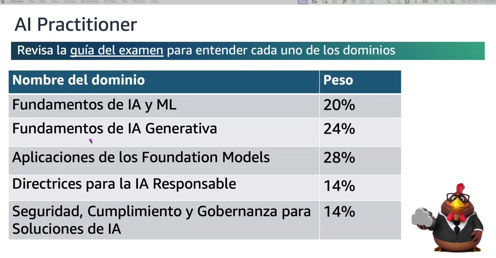

# AWS AI Practitioner - Notas de Estudio

Este repositorio contiene mis notas personales de estudio para la certificación **AWS AI Practitioner**. El material está organizado por dominios siguiendo la estructura del examen oficial.

## 📋 Recursos Oficiales

- **[Guía Oficial del Examen AWS AI Practitioner](PDFs/AWS-Certified-AI-Practitioner_Exam-Guide.pdf)**: Documento oficial de AWS con el contenido y estructura del examen.

## 📚 Estructura del Examen

La certificación AWS AI Practitioner está compuesta por 5 dominios con diferentes pesos:

| Dominio | Peso |
|---------|------|
| **Fundamentos de IA y ML** | 20% |
| **Fundamentos de IA Generativa** | 24% |
| **Aplicaciones de los Foundation Models** | 28% |
| **Directrices para la IA Responsable** | 14% |
| **Seguridad, Cumplimiento y Gobernanza para Soluciones de IA** | 14% |

## 📖 Contenido

### Dominios

#### [Dominio 1: Fundamentos de IA y ML](Dominio_1.md) (20%)

1. Explicar conceptos básicos de IA y terminologías
2. Identificar casos prácticos de uso para IA
3. Describir el ciclo de vida de desarrollo de ML

**📄 Material complementario**: [Sesión 1 - Dominio 1.pdf](PDFs/Sesión%201%20-%20Dominio%201.pdf)

#### [Dominio 2: Fundamentos de IA Generativa](Dominio_2.md) (24%)

1. Conceptos básicos de la IA generativa
2. Capacidades y limitaciones de la IA generativa para resolver problemas comerciales
3. Infraestructura y tecnologías de AWS para crear aplicaciones generativas de IA

**📄 Material complementario**: [Sesión 2 - Dominio 2.pdf](PDFs/Sesión%202%20-%20Dominio%202.pdf)

#### [Dominio 3: Aplicaciones de Foundation Models](Dominio_3.md) (28%)

1. Consideraciones de diseño para aplicaciones que utilizan Foundation Models
2. Técnicas efectivas de ingeniería de prompts
3. Proceso de entrenamiento y afinamiento de Foundation Models
4. Métodos para evaluar el desempeño de Foundation Models

**📄 Material complementario**: [Sesión 3 - Dominio 3.pdf](PDFs/Sesión%203%20-%20Dominio%203.pdf)

#### [Dominio 4: Directrices para la IA Responsable](Dominio_4.md) (14%)

1. Desarrollo de Sistemas de IA Responsable
2. Importancia de los modelos transparentes y explicables

**📄 Material complementario**: [Sesión 4 - Dominios 4 & 5.pdf](PDFs/Sesión%204%20-%20Dominio%204%20&%205.pdf)

#### [Dominio 5: Seguridad, Cumplimiento y Gobernanza para Soluciones de IA](Dominio_5.md) (14%)

1. Métodos para proteger los sistemas de IA
2. Regulaciones de gobernanza y cumplimiento para los sistemas de IA

**📄 Material complementario**: [Sesión 4 - Dominios 4 & 5.pdf](PDFs/Sesión%204%20-%20Dominio%204%20&%205.pdf)

---

**Autor**: Santiago Betancur  
**Última actualización**: 6 de Noviembre, 2025
