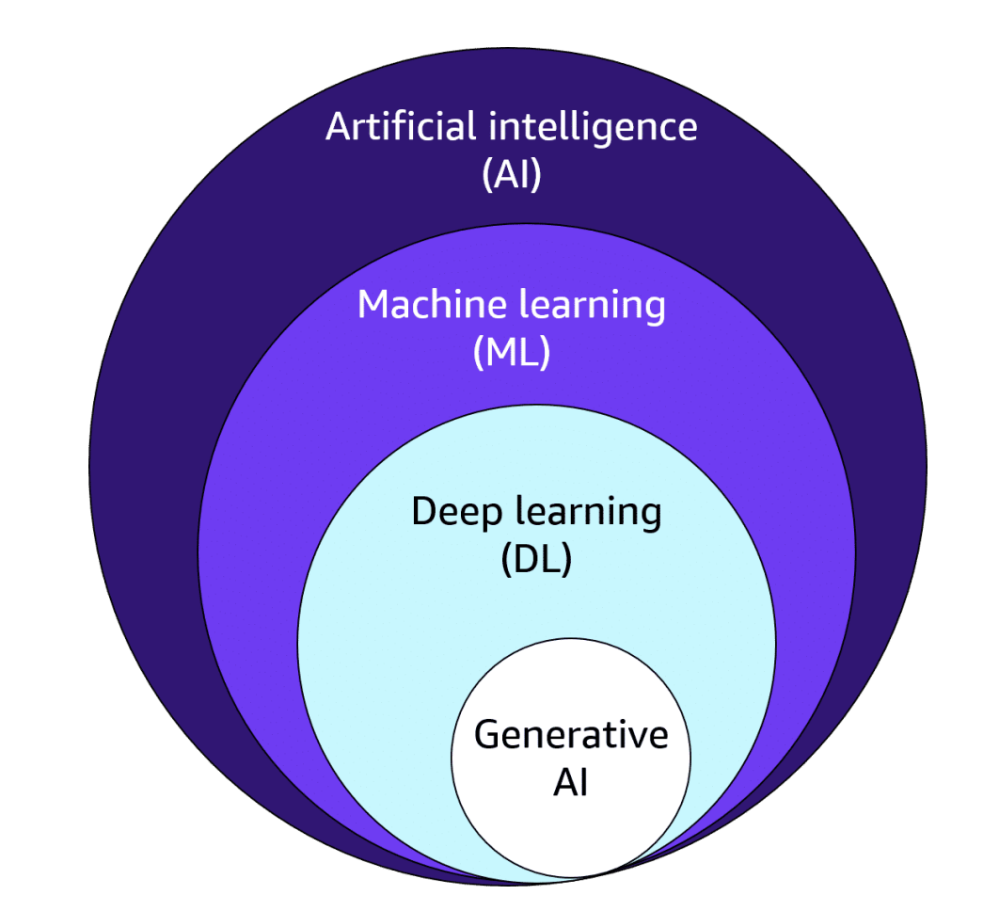
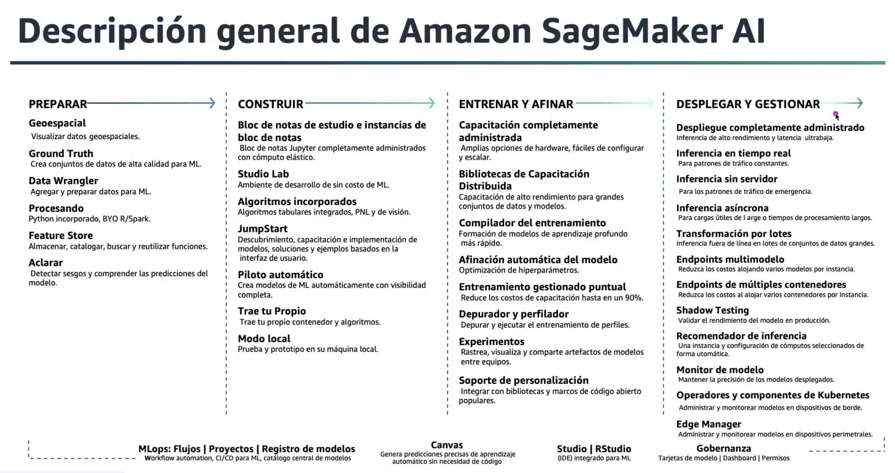

# Dominio 1: Fundamentos de IA y ML

---

## 1. Conceptos básicos y terminología

### Definiciones compactas

- **IA (Inteligencia Artificial)**: cualquier sistema que realiza tareas que normalmente requieren inteligencia humana.
- **Machine Learning (ML)**: métodos que aprenden reglas desde datos.
- **Deep Learning (DL)**: subcampo de ML con redes neuronales profundas.
- **Generative AI (GenAI)**: modelos (habitualmente DL) que generan contenido nuevo. Suelen usar embeddings.

### Paradigmas

- **Programación tradicional**: entrada + reglas → salida. Reglas fijas.
- **Programación ML**: entrada + salida → reglas. Reglas dinámicas y adaptables.

### Terminología esencial

- **Etiqueta / Target**: variable dependiente. Lo que intentas predecir.
- **Característica / Feature**: variable independiente. Datos que ayudan a predecir.
- **Ingeniería de características**: transformaciones de datos para aumentar su valor predictivo.
- **Selección de funciones (feature selection)**: elegir las variables más valiosas o subconjuntos.

### Tipos de Machine Learning

#### Aprendizaje Supervisado

Se entrena con ejemplos (entrada + etiqueta). El modelo aprende a predecir la etiqueta a partir de la entrada.

**Ejemplo**: Foto de perro → etiqueta Perro. Si el modelo predice Gato se corrige con la etiqueta real.

**Cuándo usar**: cuando tienes etiquetas confiables y claras.

#### Aprendizaje No Supervisado

No usa etiquetas. El algoritmo descubre patrones en los datos.

**Cuándo usar**: exploración de datos, segmentación, detección de anomalías.

#### Aprendizaje por Refuerzo (Reinforcement Learning)

Un agente toma acciones en un entorno. Recibe recompensas y aprende una política que maximice recompensas.

**Cuándo usar**: videojuegos, robótica, optimización secuencial.

#### Aprendizaje Auto-supervisado (Self-Supervised)

Se extraen etiquetas sintéticas del propio dato. El modelo se entrena con tareas creadas automáticamente.

**Ejemplos de tareas**:

- Masked token prediction: borrar una palabra/token y predecirla.
- Next-token / autoregresivo: predecir el siguiente token en secuencia.

### GenAI / LLMs: qué se usa

- **Pre entrenamiento principal**: auto-supervisado.
- **Ajuste fino (fine-tuning)**: a veces supervisado en tareas específicas con etiquetas humanas.
- **RLHF (Reinforcement Learning from Human Feedback)**: usar preferencias humanas para construir un modelo de recompensa y optimizar respuestas (refuerzo sobre políticas).

---

## 2. Casos prácticos de uso para IA

### Cuándo usar ML vs GenAI

**Usa ML tradicional cuando necesitas**:

- Transparencia e interpretabilidad.
- Robusteza y consistencia.
- Buen rendimiento con datasets pequeños o medianos.
- Auditoría y control de sesgos en sectores regulados.

**Usa GenAI cuando necesitas**:

- Generar texto, imágenes, código u otros contenidos nuevos.
- Respuestas conversacionales o creatividad controlada.
- Recuperación y ampliación de conocimiento vía embeddings + RAG.

**Regla práctica**: si el problema exige trazabilidad, preferir modelos tradicionales; si exige creatividad o generación, usar GenAI (evaluar riesgo de "hallucinations").

### Servicios de AWS

**Servicios principales de IA/ML en AWS**:

- **Visión**: Clasificación, detección, análisis de imágenes → `Amazon Rekognition`
- **Extracción de texto de documentos**: OCR y campos estructurados → `Amazon Textract`
- **NLP y análisis de texto**: Extracción de entidades, sentimiento, clasificación → `Amazon Comprehend`
- **Búsqueda semántica / recuperación**: Buscadores con embeddings → `Amazon Kendra`
- **Personalización y recomendaciones**: Sistemas de recomendación → `Amazon Personalize`
- **Detección de fraude**: Reglas + modelos ML especializados → `Amazon Fraud Detector`
- **Plataforma de ciclo ML**: Entrenamiento, despliegue, monitorización → `Amazon SageMaker`

---

## 3. Ciclo de vida del desarrollo de ML

### Fases del ciclo de vida de ML

1. **Definir problema**: Métrica objetivo, restricciones, impacto.
2. **Recolección de datos**: Fuentes, permisos, calidad.
3. **Exploración y limpieza**: Outliers, nulos, balance de clases.
4. **Ingeniería de features**: Transformar, crear, normalizar.
5. **Selección / entrenamiento de modelo**: Baseline → iteración.
6. **Evaluación**: Train/val/test, métricas (accuracy, F1, AUC, RMSE según caso).
7. **Despliegue**: Contenedor, endpoint, versiones.
8. **Monitorización**: Deriva de datos, rendimiento, latencia, drift y alertas.
9. **Mantenimiento**: Re-entrenamiento, pipelines automatizados.

### Amazon AI/ML Stack

### Amazon SageMaker

Plataforma completa para el ciclo de vida de ML: entrenamiento, despliegue y monitorización de modelos.

**Capacidades principales**:

- Preparación de datos y feature engineering.
- Entrenamiento distribuido de modelos.
- Ajuste de hiperparámetros automatizado.
- Despliegue de modelos en producción.
- Monitoreo y detección de deriva de datos.

### Amazon Rekognition

Automatiza el análisis de imágenes y videos con aprendizaje automático.

**Casos de uso**:

- Análisis de medios.
- Verificación de identidad.
- Moderación de contenido.

**Características clave**:

| Funcionalidad | Descripción |
|---------------|-------------|
| **Etiquetas** | Detección automática de objetos, escenas y actividades |
| **Etiquetas personalizadas** | Entrenamiento con datos propios para detectar objetos específicos |
| **Moderación de contenido** | Filtrado de contenido inapropiado o no seguro |
| **Detección de texto** | OCR en imágenes y videos |
| **Detección facial** | Identificación de rostros y sus atributos |
| **Búsqueda y verificación de rostros** | Comparación y búsqueda de rostros en colecciones |
| **Reconocimiento de celebridades** | Identificación automática de figuras públicas |
| **Pathing** | Seguimiento de movimiento de personas en videos |

### Amazon Textract

Extrae texto y datos de cualquier documento usando ML sin trabajo manual.

**Casos de uso**:

- Crear índices de búsqueda inteligentes.
- Automatizar flujos de procesamiento de documentos.
- Mantener cumplimiento en archivos documentales.

**Beneficios**:

- Extrae datos estructurados y no estructurados.
- Va más allá del OCR simple (identifica tablas, formularios, campos clave-valor).
- Soporta seguridad y cumplimiento normativo.
- Permite implementar revisiones humanas con Amazon Augmented AI (A2I).

### Amazon Comprehend

Descubre ideas y relaciones dentro del texto.

**Casos de uso**:

- Análisis del centro de atención al cliente.
- Indexado y búsqueda de reseñas de productos.
- Personalización de contenido en sitios web.

**Beneficios**:

- Obtener respuestas a partir de texto.
- Organizar documentos por temas.
- Entrenar modelos con tus propios datos.
- Soporte para texto general y específico de industria.

### Amazon Kendra

Servicio de búsqueda empresarial basado en ML.

**Casos de uso**:

- Mejorar acceso al conocimiento interno.
- Soporte de ventas y atención al cliente.
- Ayudar a usuarios a encontrar información eficientemente.

**Beneficios**:

- Consultas en lenguaje natural y respuestas inmediatas.
- Integración con múltiples fuentes de datos con pocos clics.
- Mejora continuamente los resultados de búsqueda con ML.
- Entiende el contexto y la intención del usuario.

> **Nota**: CORD-19 (conjunto de datos de investigación COVID-19) es un cliente destacado que utiliza Kendra.

### Amazon Personalize

Crea experiencias personalizadas en tiempo real y a escala.

**Casos de uso**:

- **Retail**: ayudar a clientes a descubrir productos.
- **Medios**: recomendar contenido según preferencias.

**Beneficios**:

- Entregar recomendaciones en tiempo real.
- Implementar recomendaciones en días.
- Personalizar puntos de contacto a lo largo del recorrido del cliente.

### Amazon Fraud Detector

Detecta fraudes en línea de forma rápida.

**Casos de uso**:

- Nueva cuenta fraudulenta.
- Pago en línea fraudulento.
- Checkout como invitado.
- Abuso de servicio y programas de lealtad.

**Beneficios**:

- Previene y detecta fraudes en línea.
- Detección de fraude en minutos.
- Personalizable según las necesidades del negocio.

---

## Quiz

### Pregunta 1: Tipo de aprendizaje supervisado

**Respuesta correcta**: **A** - Supervisado.

**Explicación**: El aprendizaje supervisado utiliza datos etiquetados donde cada entrada tiene una salida conocida que el modelo aprende a predecir.

---

### Pregunta 2: Sistema de recomendaciones

**Respuesta correcta**: **B** - Utilizar Amazon Personalize.

**Explicación**: Amazon Personalize está específicamente diseñado para crear sistemas de recomendación personalizados en tiempo real.

---

### Pregunta 3: Plataforma de ML

**Respuesta correcta**: **D** - SageMaker.

**Explicación**: Amazon SageMaker es la plataforma completa de AWS para el ciclo de vida de ML, desde la preparación de datos hasta el despliegue y monitoreo.

---

## Resumen del Dominio 1

Este dominio establece los fundamentos esenciales de IA y Machine Learning:

1. **Jerarquía de conceptos**: IA → ML → Deep Learning → Generative AI, cada nivel con mayor especialización
2. **Tipos de aprendizaje**: Supervisado (con etiquetas), No supervisado (patrones), Refuerzo (recompensas) y Auto-supervisado (pre-entrenamiento de LLMs)
3. **Servicios AWS especializados**: Rekognition (visión), Textract (documentos), Comprehend (NLP), Kendra (búsqueda), Personalize (recomendaciones), Fraud Detector
4. **Ciclo de vida de ML**: Desde definición del problema hasta monitoreo continuo en producción
5. **Amazon SageMaker**: Plataforma integral para todo el ciclo de vida de ML en AWS

---
