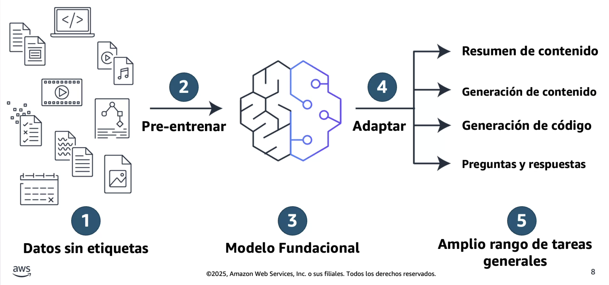
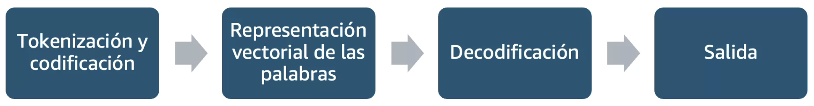
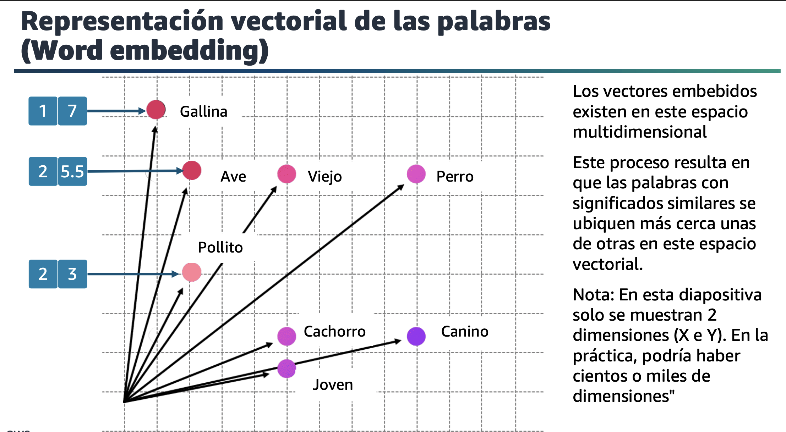
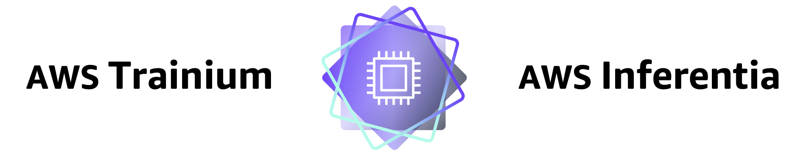
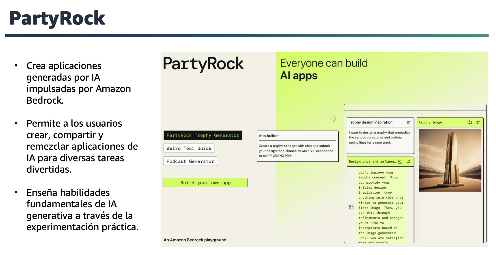
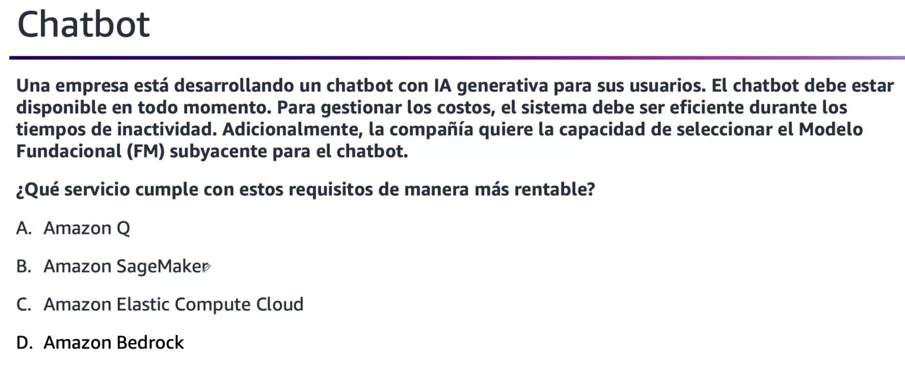

# Dominio 2: Fundamentos de la IA Generativa

---

## 1. Conceptos básicos de la IA generativa

### Modelo Fundacional (Foundation Model - FM)

Son sistemas de IA entrenados con cantidades masivas de datos no etiquetados, que aprenden patrones generales y sirven como base para múltiples aplicaciones específicas.

**Características principales**:

- Entrenamiento a gran escala con billones de parámetros.
- Transferencia de aprendizaje a diferentes dominios.
- Capacidad de generalización a nuevas tareas.
- Base para personalización mediante fine-tuning o prompting.

### Ciclo de vida FMs

> **Nota importante**: El pre-entrenamiento de los Foundation Models es de tipo "auto-supervisado".

### Tipos de Foundation Models

#### Modelos texto a texto (LLMs)

Son modelos de lenguaje grande (Large Language Models) que están pre-entrenados para procesar grandes cantidades de datos textuales y lenguaje humano.

**Ejemplos**: GPT, Claude, LLaMA.

#### Modelos de texto a imagen

Toman entrada de lenguaje natural y producen imágenes de alta calidad que coinciden con la descripción del texto de entrada.

**Arquitectura**: Basados en modelos de difusión.

**Ejemplos**: DALL-E, Stable Diffusion, Midjourney.

#### Modelos multimodales

Pueden recibir distintos tipos de entrada (imagen, texto, audio, video) y producir distintos tipos de salida.

**Capacidades**:

- Procesamiento del lenguaje natural (NLP).
- Análisis de imágenes y videos.
- Comprensión de audio y speech.
- Generación cross-modal (ej: texto → imagen, imagen → texto).

**Ejemplos**: GPT-4 Vision, Gemini.

### Componentes de Foundation Models

#### Datos sin etiquetar

- Más fácil de obtener en comparación con datos etiquetados.
- Los modelos de pre-entrenamiento toman en cuenta el contexto a partir de todos los datos de entrenamiento.
- Realizan un seguimiento de las relaciones en datos secuenciales.

#### Modelo grande

- Miles de millones de parámetros (algunos modelos superan los 100B parámetros).
- Los modelos de pre-entrenamiento de este tamaño requieren acceso a:
  - Cantidad y calidad suficientes de los datos de entrenamiento.
  - Infraestructura de entrenamiento a gran escala (GPU/TPU clusters).
  - Técnicas de optimización y paralelización.

### ¿Cómo se procesan estos datos sin etiquetar?

#### Transformer

> **Historia**: Salió en 2017 en el paper "Attention is All You Need", que propuso una arquitectura que dio base a toda la IA generativa actual.

**Características**:

- Es un tipo específico de red neuronal que potencia los modelos fundacionales mediante el procesamiento de secuencias de información.
- Analiza las relaciones entre palabras o imágenes para comprender el contexto y el significado.
- Transforma las entradas en salidas relevantes utilizando su comprensión de las relaciones entre elementos.

#### Beneficios del Transformer

- **Procesamiento paralelo**: Procesa toda la secuencia simultáneamente (vs. RNNs secuenciales).
- **Mecanismo de atención**: Capaz de mantener la atención en elementos específicos, a pesar del "ruido" o distracciones.
- **Flexibilidad y escalabilidad**: Se adapta a diferentes tamaños y tipos de datos.

#### Ejemplo de procesamiento Transformer

**Frase**: "Cachorro es a perro como pollito es a…"

**¿Cómo un Modelo Transformer completa la oración?**

> **Embedding**: Representación vectorial/numérica de los tokens.

> **Nota**: Ejemplo simplificado. Los embeddings reales pueden tener cientos o miles de dimensiones.

---

## 2. Capacidades y limitaciones de la IA generativa para resolver problemas comerciales

### Parámetros de inferencia - Aleatoriedad y diversidad

#### Inferencia

Proceso de ejecutar un modelo ya entrenado para producir predicciones. La inferencia está optimizada para:

- **Latencia**: Tiempo de respuesta.
- **Throughput**: Número de peticiones por segundo.
- **Costo**: Eficiencia computacional.

#### Filtrado y limitación de tokens

**Top-k**: Selecciona los k tokens más probables de los cuales elegir.

**Top-p (nucleus sampling)**: Selecciona tokens hasta alcanzar una probabilidad acumulativa p.

#### Control de creatividad

**Temperatura**: Controla la aleatoriedad de las predicciones (valores bajos = más determinista, valores altos = más creativo).

#### Ejemplos de parámetros de inferencia

##### Top-k

##### Top-p

##### Temperatura

### Parámetros de inferencia - Longitud

#### Longitud de respuesta

- Un valor exacto para especificar el número mínimo o máximo de tokens que se devolverán en la respuesta generada.
- Ayuda a gestionar los recursos computacionales y costos.

#### Penalizaciones

Especificar el grado en que se penalizarán ciertos patrones en las respuestas generadas.

**Ejemplos**:

- La longitud de la respuesta.
- Tokens repetidos en una respuesta.
- Frecuencia de tokens en una respuesta.
- Tipos específicos de tokens en una respuesta.

#### Secuencias de detención

- Especificar secuencias de caracteres que detienen al modelo para que no genere más tokens.
- Si el modelo genera una secuencia de parada que usted especifica, dejará de generar después de esa secuencia.

### Ventana de contexto

El contexto es un intercambio privado entre el usuario y el modelo.

**Características**:

- No persiste entre sesiones (a menos que se implemente memoria externa).
- Hay un límite superior en el número de tokens (ventana de contexto).
- Se puede perder la información inicial cuando se excede el límite.

> **IMPORTANTE**: El modelo no lee solo tu último mensaje, lee TODA LA CONVERSACIÓN de nuevo después de cada mensaje. Por eso, mientras más largo sea el chat, puede disminuir la calidad de respuesta y aumentar el tiempo/costo de procesamiento.

#### Factores que Afectan la Latencia

| Factor | Impacto | Mitigación |
|--------|---------|------------|
| **Tokens de entrada** | A más tokens, mayor tiempo de procesamiento | Optimizar prompts, resumir contexto |
| **Tokens de salida** | Generación secuencial aumenta latencia | Limitar max_tokens, usar streaming |
| **Tamaño del modelo** | Modelos grandes = mayor latencia | Elegir modelo apropiado para el caso de uso |
| **Ventana de contexto** | Conversaciones largas procesan todo de nuevo | Implementar resúmenes, limpiar historial |
| **Concurrencia** | Alta demanda puede aumentar tiempos | Provisioned throughput en Bedrock |

**Estrategias de optimización:**

- Usar **streaming** para mostrar respuestas parciales al usuario
- Implementar **caching** para respuestas frecuentes
- Seleccionar el modelo más pequeño que cumpla los requisitos
- Considerar **Provisioned Throughput** en Bedrock para cargas predecibles

#### Ejemplo de uso de contexto

### Preocupaciones de la IA Generativa

**Desafíos y riesgos a considerar**:

- **Toxicidad**: Generación de contenido ofensivo o dañino.
- **Alucinaciones**: Generación de información incorrecta presentada con confianza.
- **Propiedad Intelectual**: Uso no autorizado de contenido protegido.
- **Plagio y trampa**: Mal uso académico o profesional.
- **Disrupción laboral**: Impacto en la naturaleza del trabajo y empleos.
- **Sesgos**: Reproducción de sesgos presentes en los datos de entrenamiento.
- **Privacidad**: Filtración potencial de información sensible.

---

## 3. Infraestructura y tecnologías de AWS para crear aplicaciones generativas de IA

### Recursos de IA generativa de AWS

### Innovación a nivel de silicio

#### AWS Trainium

Familia de chips de AWS optimizados para entrenamiento e inferencia de modelos de Deep Learning.

**Ventajas**:

- Hasta 50% de ahorro en costos de entrenamiento vs. instancias comparables.
- Rendimiento optimizado para modelos grandes.
- Integración nativa con frameworks de ML (PyTorch, TensorFlow).

#### AWS Inferentia

Acelerador diseñado específicamente para inferencia de ML a gran escala, disponible en instancias Inf.

**Ventajas**:

- Más de 70% más eficiente frente a instancias EC2 similares.
- Baja latencia y alto throughput.
- Costo-efectivo para producción a escala.

### Servicios AWS

#### Amazon SageMaker AI

Plataforma completa para crear, entrenar e implementar modelos de ML a escala, incluidos los Foundation Models.

**Capacidades**:

- Acceso a los últimos FMs disponibles públicamente a través de **SageMaker JumpStart**.
- Construir Foundation Models desde cero.
- Personalizar FMs con tus propios datos.
- Ejecutar inferencia optimizada.
- Implementar FMOps (MLOps para Foundation Models) y gobernanza.

#### Amazon Bedrock

Servicio totalmente administrado que ofrece Foundation Models de alta calidad de empresas líderes en IA.

**Capacidades**:

- Elección de FMs líderes a través de una única API (Anthropic, Meta, Amazon, etc.).
- Personalización del modelo sin necesidad de infraestructura.
- Generación Aumentada de Recuperación (RAG) integrada.
- Agentes que ejecutan tareas de varios pasos de forma autónoma.
- Seguridad, privacidad y gobernanza empresarial.

#### Amazon Q

Asistente de IA generativa de AWS para desarrolladores y empresas.

**Capacidades**:

- Asistencia en código y desarrollo (Amazon Q Developer).
- Respuestas sobre servicios y mejores prácticas de AWS.
- Análisis de datos y generación de insights empresariales.
- Integración con aplicaciones empresariales.

> **Nota**: Amazon Q Suite fue anunciado el 9 de octubre de 2025 como evolución/unificación que incluye capacidades Agentic AI. QuickSight se mantiene dentro del suite para visualización.

#### PartyRock

Plataforma de experimentación con IA generativa sin necesidad de código.

**Características**:

- Creación rápida de prototipos con Foundation Models.
- Interfaz visual intuitiva.
- Ideal para aprendizaje y exploración de capacidades de GenAI.
- No requiere experiencia en programación.

### Enfoques para personalizar Foundation Models

### Personalización de las respuestas del modelo

#### Fine-tuning (Afinamiento)

**Objetivo**: Maximizar la precisión para tareas específicas.

**Requisitos**:

- Pequeño número de ejemplos etiquetados (cientos a miles).
- Recursos computacionales moderados.
- Datos de calidad específicos del dominio.

**Cuándo usar**: Cuando necesitas que el modelo se especialice en una tarea o dominio específico.

#### Pre-entrenamiento continuo

**Objetivo**: Mantener la precisión del modelo para un dominio específico.

**Requisitos**:

- Gran cantidad de conjuntos de datos sin etiquetar.
- Recursos computacionales significativos.
- Datos representativos del dominio objetivo.

**Cuándo usar**: Cuando necesitas adaptar el modelo a un dominio con vocabulario o patrones únicos (ej: médico, legal, financiero).

---

## Quiz

### Pregunta 1: Parámetros de inferencia

**Respuesta correcta**: **A** - Temperatura controla la creatividad, top_p limita la elección de siguientes tokens de acuerdo a la probabilidad acumulativa.

**Explicación**: La temperatura ajusta la aleatoriedad de las predicciones, mientras que top_p (nucleus sampling) selecciona el conjunto más pequeño de tokens cuya probabilidad acumulativa alcanza el valor p.

---

### Pregunta 2: Foundation Models para empresa minorista

**Respuesta correcta**: **C** - SageMaker JumpStart permite comenzar rápidamente con Foundation Models previamente entrenados, como BERT o T5.

**Explicación**: SageMaker JumpStart ofrece acceso a modelos pre-entrenados listos para usar o personalizar, ideal para comenzar rápidamente sin entrenar desde cero.

---

### Pregunta 3: Implementación de chatbot

**Respuesta correcta**: **D** - Amazon Bedrock, ya que ofrece FMs entrenados y cobra solo por uso de tokens.

**Explicación**: Amazon Bedrock es ideal para aplicaciones de chatbot porque proporciona acceso a FMs de alta calidad sin necesidad de gestionar infraestructura, con un modelo de pricing por uso.

---

## Resumen del Dominio 2

Este dominio cubre los fundamentos esenciales de la IA Generativa:

1. **Foundation Models (FMs)**: Modelos pre-entrenados a gran escala (LLMs, texto-imagen, multimodales) basados en arquitectura Transformer
2. **Mecanismo Transformer**: Procesamiento paralelo con mecanismo de atención, usa tokenización y embeddings para comprender contexto
3. **Parámetros de inferencia**: Control de creatividad (temperatura), filtrado de tokens (top-k, top-p), longitud y penalizaciones
4. **Ventana de contexto**: El modelo procesa toda la conversación en cada mensaje, lo que afecta calidad, tiempo y costo
5. **Servicios AWS**: Amazon Bedrock (FMs como servicio), SageMaker AI (plataforma ML completa), Amazon Q (asistente IA), PartyRock (prototipado)
6. **Personalización de FMs**: Fine-tuning (tarea específica) vs Pre-entrenamiento continuo (dominio específico)
7. **Desafíos**: Alucinaciones, sesgos, toxicidad, privacidad, propiedad intelectual

---

## Infografía útil

Esta visualización muestra cómo los Large Language Models procesan y comprenden el texto a través de embeddings vectoriales y relaciones semánticas.
